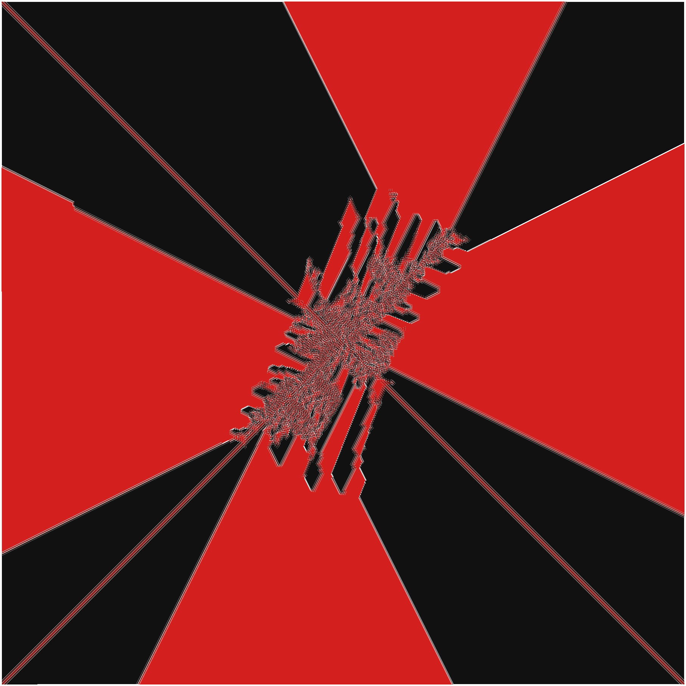
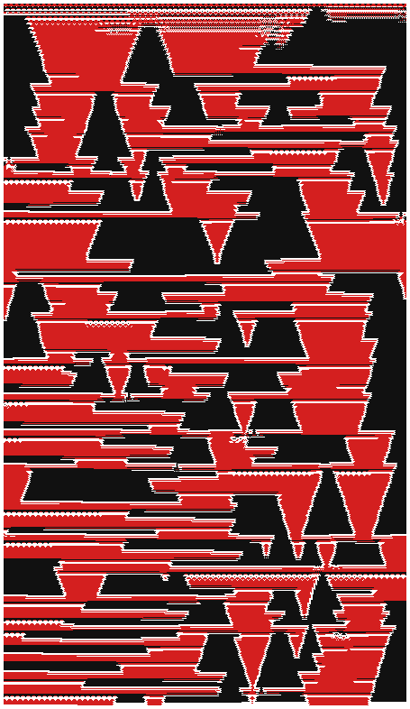
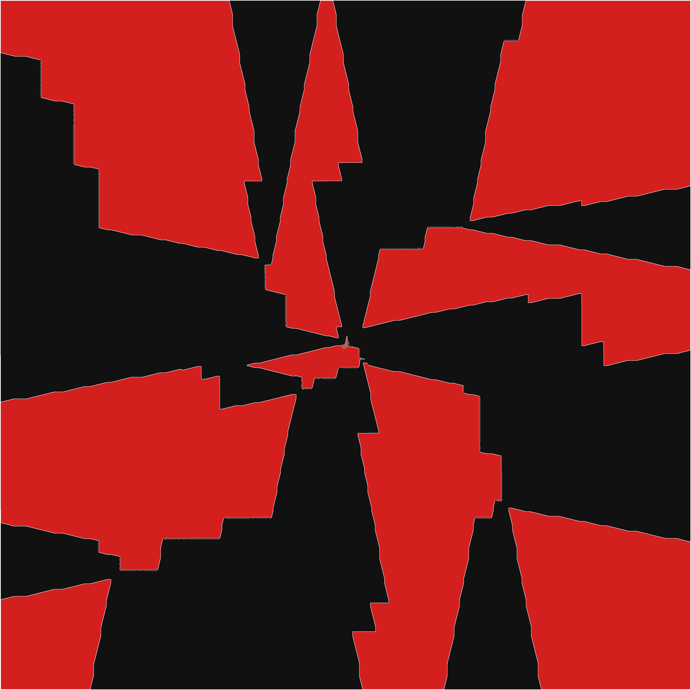

# Piece Patterns on an Infinite Board

Visualizes how chess pieces from competing teams arrange themselves when placed greedily on an infinite board. **[Open the app →](https://sullerandras.github.io/red-and-black-knights/)**

Inspired by these Numberphile videos:
- [Red & Black Knights (extraordinary result)](https://www.youtube.com/watch?v=UiX4CFIiegM)
- [Amazing Chessboard Patterns (extra)](https://www.youtube.com/watch?v=VgmDuBCayPw)

## How it works

Teams take turns placing pieces. Each piece lands on the lowest-numbered unoccupied cell that is not attacked by any opposing team. The cell numbering follows the chosen layout, and the resulting patterns can be surprisingly structured.

## Options

**Teams** — 2–6 teams, each with a color and piece type. Available pieces include knight, camel, zebra, giraffe, alfil, dabbaba, ferz, wazir, king, bishops/rooks/queens up to 2 steps, and custom (a+b) leapers.

**Layouts**
- *Center Spiral* — cells numbered outward from the center in a square spiral
- *Corner Diagonal* — cells numbered along anti-diagonals from the top-left corner
- *Zigzag Rows* — boustrophedon rows from the top-left, with configurable row width

**Sequential placement** — when enabled, each team must place after the globally last-placed position rather than its own personal lowest available cell.

**Gallery** — renders thumbnails for all piece-type combinations in a grid so you can survey patterns at a glance. Rows vary team 1's piece type, columns vary team 2's — any additional teams stay fixed at their current settings. Click any cell to apply that configuration.

## Examples

*Click an image to open the interactive version.*

**Alfil and 3-leaper, center spiral, 3.2M pieces**

**Leaper (3+4) and queen, zigzag width 447, 300k pieces**

**Zebra (2+3) and bishop (<=2), 1M pieces**

The black regions are all connected!

